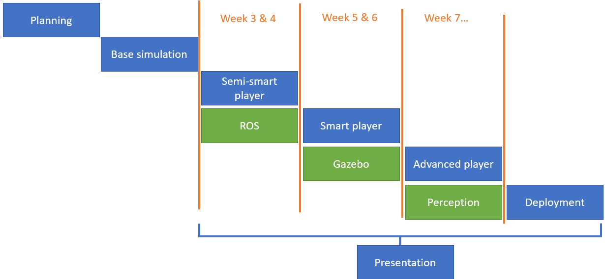

# Result Analysis

##### [Go back to main page](../Documentation.md)

## Analysis
### Efficient Software Development approach (Agile)
For a system to be built from scratch, the workflow must be completed first, which is very important. In this project, we used a part of agile methodologies to make our work more flexable and measuable. At the very begining, we setup our mile stones for the whole development life cycle. 
<!--   
**Figure :** Mile Stone -->

Because of the limitation on the number of people, the five of us are not only developers but also tester, scrum master, and product owner. From the begining to the end, we devide work according to our different roles and we use the dashboard provided by github to arrange work, which make our work monitored and easy to find problems. 
  
**Figure :** Task Dashboard

### Flexible and Robust System Architecture
1. In this project, we keeps the good extensibility all the time. We have two controller access modes, which are individual access and decision tree access. Either one follows OOP principles to reserve channels for the extension of algorithms.
2. From low level point of view, each robot controller has same pipline of receiving environment data and then processing data and then output control command.They are independent of each other. In the actual match, if one goes down, the other robots will not be affected. Besides, to make sure the program runs stably, we added the error handling in each critical logic place. Although due to time constraints we were not able to add the logging collection feature, we reserved the interfaces for this.
## Test Cases
- Go to point  

||  Steps   | Expect Result  | Result |
| ----  |   ----  | ----  | ----  | 
|1|  Set a target point and let player from a random position to start moving | The player go straight to the target point |Pass 
  figure : go to point test

- Go around point  

||  Steps   | Expect Result  | Result |
| ----  |   ----  | ----  | ----  | 
|1|  Set a target point and let player from a random position to start moving | The player will go around the target point until find the best angle towards opponent gate |Pass 
  figure : go around point test

- Kick ball  

||  Steps   | Expect Result  | Result |
| ----  |   ----  | ----  | ----  | 
|1|  Set player to a random position and no enemy in the way. Let player to kick the ball| The player will find a appropriate angle and shoot|Pass 
  figure : test kick

|2|  Set player to a random position and one enemy in the way. Let player to kick the ball | The player will find a appropriate angle and shoot |Pass. And the shoot angle become larger
  figure  : test kick with one enemy

|3|  Set player to a random position and four enemy in the way. Let player to kick the ball | The player will find a appropriate angle and shoot |Pass. And the shoot angle become larger 
  figure : test kick with four enemy

|4| Set player to a random position and five enemy in the way, which give no space and chance to let the player kick the ball | The player will just dribble the ball or wait other team member |Pass 
  figure: test kick with five enemy

- Dribble 

||  Steps   | Expect Result  | Result |
| ----  |   ----  | ----  | ----  | 
|1|  Set the ball to a random position and let player from a random position to start moving | The player will dribble the ball to the opponent gate direction |Pass 
  figuredribble test

|2|  Set player in upper or lower field | The player will dribble the ball along corresponding path  to the gate|Pass 
  figure :dribble from different direction

- Avoid Obstacle

||  Steps   | Expect Result  | Result |
| ----  |   ----  | ----  | ----  | 
|1|  Run a demo match. Put players closed or make players to persue one ball. Observe whether players will get stuck with each other | Players have the ability to avoid obstacle|Pass. If get stuck, player can redirect itself
  figure : avoid obstacle between two players test

- Pass Ball & Go To strategy position

||  Steps   | Expect Result  | Result |
| ----  |   ----  | ----  | ----  | 
|1|  Run a demo match. Put players randomly. Set virtual enemies to force players to pass ball. |N/A|N/A| 
|2|  Keep observe whether the pass ball action work normally. If not, you also can change the initial positions  | The action of passing ball work normally and the corresponding team member could also go to the strategy position automatically |Pass
  figure : avoid obstacle between two players test

- Offside warning line

||  Steps   | Expect Result  | Result |
| ----  |   ----  | ----  | ----  | 
|1|  Run a demo match. Players start from opening positions|N/A|N/A| 
|2|  Keep checking whether the line could indicate the offside position. Whether the line is pink.  | The color of warning line is pink. The line could indicate the possible offside position x. |Pass. Both warning line works well
  figure : offside warning line test
